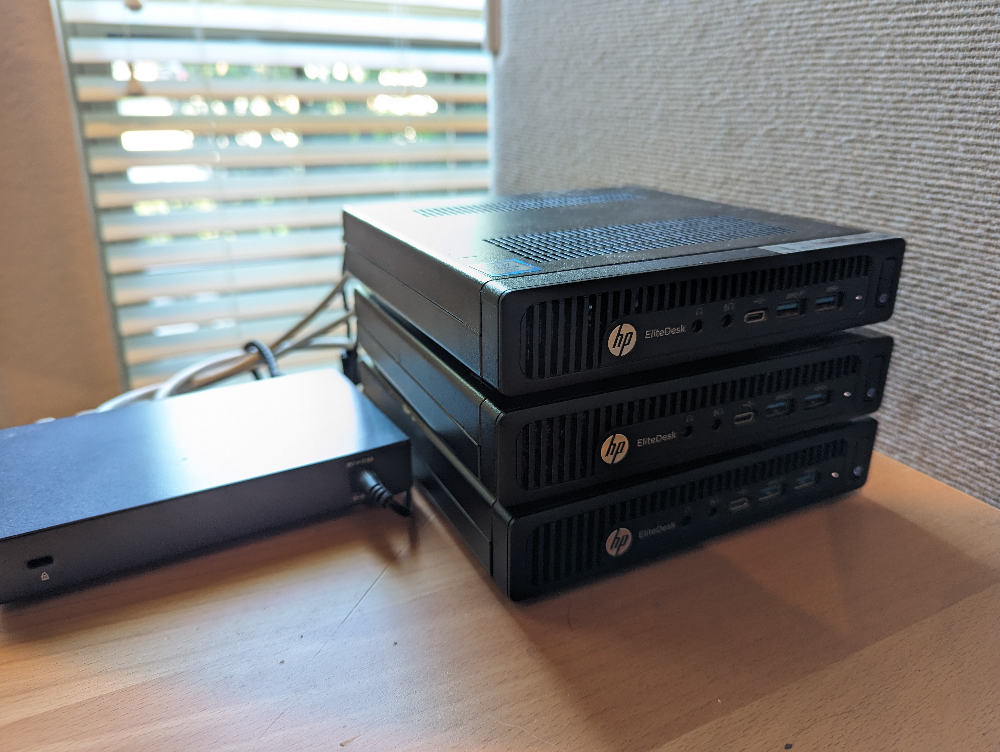

Although Kubernetes has been around since all the way back in 2014, it took a few years of development before it entered the zeitgeist. I became aware of it many years later, and accepted my first job opportunity using Kubernetes in 2020. Like most people, my first expose to it was as a managed service via a cloud provider.

I think technology professionals can all agree that cloud providers are amazing platforms, enabling us to build and scale applications with a fraction of the effort that used to be required. I have used every major cloud provider, as well as some more niche ones like Digital Ocean. For all the benefit that cloud providers bring to the table, they have one serious drawback: cost.

Everyone can relate to the horrifying realization that you left a Virtual Machine running all month and have to pay a hefty bill for infrastructure that was barely used. I have done this at least a half dozen times or more. Yes, cost alerts are a thing now and those are tremendously helpful for trying to avoid these situations. But the better option for testing is deploying your software on inexpensive hardware that you purchased outright. Then your only recurring cost is the cost of electricity. No more waking up frantically the next morning because you forgot to shutdown your VM with 4 Tesla GPUS (true story).

In the early days of the cloud, self hosting applications on your own infrastructure was always possible but not ideal because you could duplicate the ease of development afforded to you when using a public cloud provider. Kubernetes is a paradigm shift. Because of its mature and robust API design, deploying your app on AWS Elastic Kubernetes Service (EKS), Azure Kubernetes Service (AKS) or Google Kubernetes Engine (GKE) is a very comparable experience. The main exception to that rule is setting up networking for routing traffic to your cluster. Each provider has its own special annotations and considerations when exposing your applications to the world. But 90 percent of your YAML templates will look the same.

This will be the first in a multipart series where we will be setting up the necessary infrastructure and CI/CD workflows to deploy a web application on Kubernetes and expose it to the world securely. The web application we will be deploying is called [Conduit (RealWorld)](https://github.com/gothinkster/realworld), which is fullstack clone of Medium.com. What I love about this project is that there are numerous different implementations with a mix of different frontend and backend technologies. As long as your frontend and backend are API compatible, you can mix and match these components. They have a public repository where you browse the different implementations and filter based on the language and/or framework: [RealWorld registry](https://codebase.show/projects/realworld).

Later parts in the series will include sample repositories and detailed walkthroughs if you wish to follow along. I decided against making the first part a walkthrough, mainly because I want to encourage the reader to conduct their own research into the available tools and come up with a solution that works best for their needs.

---

# Prerequisites

This blog series assumes you already have some familiarity with basic Kubernetes usage and have the necessary tools installed on your computer, mainly `kubectl`.

If you have no prior background with Kubernetes, there is a plethora of great learning materials to be found. I will provide a short, non-comprehensive list of different learning sources below.

| Format            | Title                                                                                                   | Publisher                  | Price  |
|-------------------|---------------------------------------------------------------------------------------------------------|----------------------------|--------|
| Web Tutorial      | [Learn Kubernetes Basics](https://kubernetes.io/docs/tutorials/kubernetes-basics/)                      | Kubernetes Documentation   | Free   |
| Self Paced Course | [Introduction to Kubernetes](https://training.linuxfoundation.org/training/introduction-to-kubernetes/) | Linux Foundation           | Free   |
| Video             | [Kubernetes Tutorial for Beginners](https://www.youtube.com/watch?v=X48VuDVv0do)                        | TechWorld with Nana        | Free   |

In my opinion, video courses are a great place to start to start getting familiar with the lingo but they should not be your only source of learning. The knowledge will stick much faster when you are following along and running different commands yourself.

---

# Quick and dirty route

A quick sidebar before we proceed further. If your goal in having a homelab cluster is simply to learn deploying applications and get exposure do it, there are some really great tools for deploying a cluster on your laptop or desktop computer.

[Minikube](https://minikube.sigs.k8s.io/) is the obvious choice for these type of scenarios. They support both VM and container based node deployments, which gives this tool the best flexibility. There are binaries for Linux, MacOS and Windows. For node deployment, it supports the following platforms: Docker, QEMU, Hyperkit, Hyper-V, KVM, Parallels, Podman, VirtualBox, or VMware Fusion/Workstation. I have used minikube on many occasions and it is a great tool for prototyping.

[Kind](https://kind.sigs.k8s.io/) (Kubernetes in Docker) is a newer tool but the concept is the same. This tool leverages an architecture called "Docker in Docker", which is exactly what it sounds like. Virtualization and Kubernetes are not the best of friends when it comes to performance. But again, this is not meant for production workloads it is designed as a testing framework.

But that is not what I have in mind for my cluster. I want dedicated hardware separate from my primary workstation so I can deploy applications I use in my day to day life. And because playing with hardware is fun!

---

# Hardware

The inspiration I had for initially building my homelab cluster was [this great video series](https://www.youtube.com/watch?v=bx4_QCX_khU&list=PLC53fzn9608B-MT5KvuuHct5MiUDO8IF4) by Patrick Kennedy over at [ServeTheHome](https://www.servethehome.com/). Before laptops became ubiquitous in most organizations, there was a time when "mini PCs" became a popular choice for employee workstations. These machines have some obvious advantages over traditional full or even mid tower desktops. For one, their smaller size enables things like mounting them behind a monitor via VESA mounting brackets. The smaller size also means they take up less inventory space. Also, probably most importantly, they will generally have much lower power requirements than a full tower PC.

But almost no organizations issue PCs of any kind to employees and laptops rein supreme. This is great for homelab enthusiasts because it means there is a huge supply of these computers sitting around collecting dust. And some amazing deals to be had, considering their capabilities.

The above video and companion blog post focuses on the following hardware choices from three different vendors:
- Lenovo ThinkCentre Tiny
- HP EliteDesk and ProDesk
- Dell OptiPlex Micro

There are several variations with different CPU architectures and default RAM configurations. At the time I completed the cluster initially, I was working at Hewlett Packard Enterprise. So I decided purchase three HP EliteDesk 800 G2 Mini units off eBay. These ship with a quad-core intel i5-6500 CPU (3.2 GHz) along with 16 GB of DDR4 memory. And my units shipped with a single 16 GB module so these nodes could easily be doubled in memory. These were seller refurbished units but they all worked as expected. We aren't trying to win any beauty contest here: we simply want the best bang for the buck.

> My current homelab Kubernetes cluster, consisting of  three HP 800 G2 Mini PCs and a Netgear switch

Several years have elapsed since the time I purchased this hardware and there is likely a better choice to maximize price to performance ratio, so please do your own research before throwing down any cash. The homelab community is very large and you can find a lot of up to date guides on [places like Reddit](https://www.reddit.com/r/homelab/) for speccing out a great setup with your desired budget.

In terms of networking, you could go  wired or wireless. Initially I tried using some tiny USB wireless adapters on my nodes but ran into driver compatibility issues. So if you do want to opt for the wireless approach, make sure you do some legwork beforehand to make sure you won't be stuck troubleshooting issues for hours like I did. Wired networking is always more reliable anyways, so that would be my recommendation.

For storage, my recommendation would be to get nodes with at least two SSDs installed in each node. Ideally, these drive configurations should be identical between all the nodes you are using for the cluster. This will enable us to configure a clustered storage service like Rook/Ceph, which will help improve disaster recovery and developer experience. We will be covering this topic in a later post.

# Operating System

Since you are going to be SSH'ing into these instances fairly regularly to perform various maintenance activities, my suggestion would be to use the Linux distribution you are most comfortable with. CentOS, Fedora, openSUSE, Debian, or Ubuntu are all solid potential options here. I landed on Ubuntu Server because it is well tested with the distribution I ended up selecting.

God forbid you wanted to deploy Kubernetes on Windows, there are distributions with support for Windows. But cmon...lets get real. If you are building a homelab you don't want Microsoft anywhere near your machine. We want these things to be rock solid and not tip over because some random Windows Update in the middle of the night that we never asked for.

# Kubernetes Distribution

Because Kubernetes is an set of processes and APIs, not a single binary, there are many different distributions or "flavors" to choose from. In the homelab space, there are really three choices you should consider when designing your cluster. I can't remember exactly why I ended up going for microk8s over any of these other options. All of the below distributions have a straightforward setup process and are specifically designed for IoT and edge computing applications, meaning they have a small installation footprint and very low resource requirements. You can even run k3s on a Raspberry Pi, if you so desire.

### k3s

**Overview:** k3s is a lightweight Kubernetes distribution designed for IoT and edge computing. It's a fully conformant Kubernetes distribution with a small memory footprint and reduced resource usage.

**Supported Operating Systems:** Linux (SUSE Enterprise /  openSUSE, Red Hat Enterprise / CentOS / Fedora,  Ubuntu / Debian, Raspberry Pi)

**CPU Architectures:** Supports x86_64, armhf, arm64/aarch64, s390x

**System Requirements**: 1vCPU, 512 MB RAM

**Software Updates:** Regularly updated with new Kubernetes releases and patches, offering easy upgrade paths through simple commands.

**Link:** https://k3s.io/

### k0s

**Overview:** k0s is an open source, all-inclusive Kubernetes distribution, which is configured with all of the features needed to build a Kubernetes cluster. Due to its simple design, flexible deployment options and modest system requirements, k0s is well suited for public cloud, bare metal, edge and IoT.

**Supported Operating Systems:** Linux (distributions not specified), Windows Server 2019

**CPU Architectures:** Supports x86-64, ARM64 and ARMv7

**System Requirements**: 1vCPU, 1 GB RAM

**Software Updates:** Maintained by Mirantis, k0s offers regular updates and supports an automated update mechanism to keep the cluster components current.

**Link:** https://k0sproject.io/

### microk8s

**Overview:** MicroK8s is a single-package, lightweight Kubernetes distribution designed for local development, CI/CD pipelines, and IoT. It's easy to install and use, providing a full Kubernetes environment in a small footprint.

**Supported Operating Systems:** Available for Linux, macOS, and Windows through multipass or native installations.

**CPU Architectures:** Supports x86_64 and ARM architectures, making it versatile for various hardware platforms.

**System Requirements**: 1vCPU, 540 MB RAM

**Software Updates:** Canonical, the maintainer, provides frequent updates and patches. Users can switch between stable, beta, and edge channels for different levels of stability and features.

**Link:** https://microk8s.io/

# Setup

Now that you have made decisions on hardware, operating system and k8s distribution, you are ready to piece it all together. Flash a USB drive with your desired OS and install it on all of your nodes. Most Linux distributions provide an option to install OpenSSH server during install, so you will need to ensure your nodes have SSH enabled before proceeding. I would recommend copying your computer's public key to the node's authorized keys list so you can use key based authentication, using the `ssh-copy-id <host>` command.

*Tip: If you are using Linux on your personal workstation, use the same username when installing the OS on your nodes. That way when you SSH to your nodes, you can omit the username.*

Then follow the distribution specific documentation to install and initialize your cluster. I will not be covering it in this series but if you wanted to go the extra mile here, you could use a [Configuration Management](https://www.redhat.com/en/topics/automation/what-is-configuration-management) tool like Ansible, Chef or Puppet for automating the installation of your Kubernetes  distribution to your nodes. This will also make it much easier to install new OS packages and keep your nodes in sync with each other. For example, [you can find an Ansible role for installing microk8s](https://github.com/istvano/ansible_role_microk8s). The importance of this step really depends on the number of nodes in your cluster. In my case, I have a three node cluster so I didn't feel like this was really necessary.

Regardless of the distribution you choose, you will need to decide which systems will be "control plane" nodes and which will be "worker" nodes. In a production environment, it is always recommended to have separate nodes to act as the control plane. However, in a homelab scenario this will likely result in a lot of idle compute. A three node cluster where the nodes act as both control plane and workers is the sweet spot for most homelab scenarios. That is how my cluster is configured.

At the end of this process, there should be a way to retrieve your kubeconfig file, which you will need to copy to your machine to establish a connection. After copying to your workstation, install it in the default location: `~/.kube/config`. To verify the cluster is working as expected, execute a quick `kubectl get pod` and ensure that you get a response from the cluster.

# Next Steps

At this stage, you should have a working Kubernetes cluster on which you can deploy your applications. I mentioned earlier in this article that one way Kubernetes distributions often differ is when it comes to networking. If you are used to working with Kubernetes on the public cloud, you might notice there is no LoadBalancer Kubernetes object in your homelab. That is because the LoadBalancer CRD is not a Kubernetes primitive; public cloud providers implement their own variations of the LoadBalancer to integrate it with their Load Balancing services, and the APIs for those services all differ dramatically.

You can create a NodePort service on your cluster and establish a connection from your home network pretty easily. But if you want that service to be reachable outside the home, we need some additional tooling. You could create NodePort services and then port-forward the connection from your home router. However, I would **_HIGHLY_** recommend against this approach unless you are experienced with this sort of thing. Opening ports on your router is very dangerous and could lead to DDoS attacks or someone gaining access to your network.

There is a better way: [Cloudflare Tunnels](https://www.cloudflare.com/products/tunnel/). This enables us to expose web applications without ever opening a single port. Cloudflare has a very sophisticated set of tools for monitoring incoming  requests and preventing DDoS attacks and other cyber attacks. The next post in this series will show you how to configure this in your cluster.