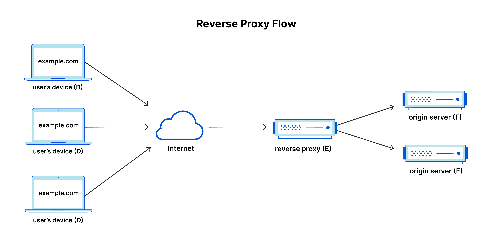

In our previous installment, we talked about purchasing the necessary hardware and setting up the necessary software to run your own Kubernetes cluster at home. At this stage, you should have a properly configured cluster which you can access from your workstation.

We now shift our focus to networking. This is the stage where many people might throw their hands up and add this to the abandoned projects graveyard. Dealing with firewalls on your home router can be very difficult to configure properly if one doesn't have the necessary experience. Furthermore, most people don't have the necessary hardware to configure things like [VLANs (Virtual Local Area Network)](https://www.techtarget.com/searchnetworking/definition/virtual-LAN), which can be used to segment your network and reduce the risks that come along with self-hosting.

The better choice is to leverage a [reverse proxy](https://www.cloudflare.com/learning/cdn/glossary/reverse-proxy/), which will route requests from the public internet to inside our home firewall, without the need to open a single port.



As with any web service, there are a few options to consider here:

- [ngrok](https://ngrok.com)
- [Serveo](https://serveo.net)
- [LocalTunnel](https://github.com/localtunnel/localtunnel)
- [PageKite](https://pagekite.net)

From my research, it seems like ngrok and Cloudflare are the only options which already have a Kubernetes deployment method, so we will only be discussing these two options.

---

# Kubernetes Reverse Proxy Solutions

## ngrok

This is a service I found many years ago when doing web development. When ngrok first came on the market, they were focused on providing reverse proxy capabilities. The platform has since evolved quite a bit since then.

> ngrok consolidates the traditional pile of ingress tools into one platform. Traditionally, creating ingress for your application services requires stitching together multiple different software components. There's a reverse proxy, load balancer, API gateway, firewall, delivery network, WAF, caching layer, application middleware, DDoS protection and more. ngrok collapses these components into a platform with unified configuration and observability.
>
> Source: [Why ngrok](https://ngrok.com/docs/why-ngrok/)

ngrok has an officially supported Kubernetes operator, which supports both Ingress objects and the newer Gateway API. There are some definite advantages of using an integration that exposes services using Kubernetes primitives as opposed to Custom Resource Definitions (CRDs). While ngrok does offer a free tier, you will be unable to use custom domains without paying for at least the "Personal" tier, which will run you $10/month ($8/month if billed annually). On the free tier, you are also limited to HTTP tunnels. The Personal tier limits you to one reserved TCP address, for forwarding non-HTTP traffic.

## Cloudflare Tunnels

Cloudflare, founded in 2009, specializes in web infrastructure and security services. They offer a global Content Delivery Network (CDN) to enhance load times and reduce latency, DDoS protection to maintain accessibility during traffic spikes, DNS services to improve domain resolution speed and reliability, and a Web Application Firewall (WAF) to protect against web-based attacks.

Beyond their networking-focused offerings, Cloudflare also provides compute and storage capabilities. The platform emphasizes Workers, a globally distributed Function-as-a-Service. Complementary services expand Workers' use cases: R2, an S3-compatible object storage service; D1, a serverless SQL database; Vectorize, a globally distributed vector database for building full-stack AI-powered applications; and KV, a low-latency key-value data storage service.

In my opinion, Cloudlare is just a more mature platform that has been battle tested and is actively used by many of the largest enterprises. All of the features that we need for this project falls under their "Zero Trust" suite of products, which are available in their free tier.

> Zero Trust Network Access (ZTNA) is the technology that makes it possible to [implement a Zero Trust security model](https://www.cloudflare.com/learning/access-management/how-to-implement-zero-trust/). "[Zero Trust](https://www.cloudflare.com/learning/security/glossary/what-is-zero-trust/)" is an IT security model that assumes threats are present both inside and outside a network. Consequently, Zero Trust requires strict verification for every user and every device before authorizing them to access internal resources.
>
> Source: [What is Zero Trust Network Access](https://www.cloudflare.com/learning/access-management/what-is-ztna/)

The Cloudflare Zero Trust suite is quite expansive, so we will not be covering it in depth. We will be focusing on the tunneling feature for the duration of this post. In a later installment, we will cover enabling IAM to restrict access to applications based on different authentication methods.

---

# Cloudflare Tunnels Setup

## Prerequisites

In order to configure a Cloudflare tunnel, you will need to have a custom domain that is registered under your Cloudflare account. If you already have a domain that you have been using in your development environments that is currently managed by a different DNS provider, you can setup a zone in Cloudflare mapped to a subdomain. However, my recommendation would be to purchase a brand new domain, with it being used strictly for your homelab cluster. You can easily register new domains through the Cloudflare console, or configure a new zone and update your the nameservers in your DNS provider appropriately. Once you have at least one DNS zone configured in the Cloudflare console, we are ready to continue.

## Install the Operator

The operator that we will be installing is maintained by user [@adyanth](https://github.com/adyanth/) on GitHub: [Cloudflare Operator](https://github.com/adyanth/cloudflare-operator). To install the operator into your cluster, follow the [Getting Started](https://github.com/adyanth/cloudflare-operator/blob/main/docs/getting-started.md) guide listed in the repository. You will need two secrets to authenticate your requests: the Global API Key and an API Token. The linked guide has detailed instructions on where to retrieve or generate these secrets.

Once you have those secrets, issue the following command to install the Custom Resource Definitions into your cluster:

```
kubectl apply -k https://github.com/adyanth/cloudflare-operator/config/default
```

After you have executed this command, we should have a few new Custom Resources available for use in our cluster: **Tunnel**, **ClusterTunnel**, and **TunnelBinding**. The Tunnel and ClusterTunnel will create a deployment using the Cloudflare tunnel daemon, cloudflared. As you may have guessed, the only difference is that one is scoped to the namespace and one is available cluster-wide.

## Add secrets

Before we can create a Tunnel or ClusterTunnel, we must create a Kubernetes secret containing the contents of our secrets. If you applied the operator using the default values, it should have created a new namespace called `cloudflare-operator-system`. We can  create the secret using:

```
kubectl -n cloudflare-operator-system create secret generic cloudflare-secrets --from-literal CLOUDFLARE_API_TOKEN=<api-token> --from-literal CLOUDFLARE_API_KEY=<api-key>
```

## Configure Tunnel

With that completed, we can now create a cluster which will bind our `cloudflared` deployment to our custom domain:

```
# clustertunnel.yaml
apiVersion: networking.cfargotunnel.com/v1alpha1
kind: ClusterTunnel
metadata:
  name: cluster-tunnel           # The ClusterTunnel Custom Resource Name
spec:
  newTunnel:
    name: k8s-tunnel             # Name of your new tunnel on Cloudflare
  size: 2                        # This is the number of replicas for cloudflared
  cloudflare:
    email: email@example.com     # Your email used to login to the Cloudflare Dashboard
    domain: example.com          # Domain under which the tunnel runs and adds DNS entries to
    secret: cloudflare-secrets   # The secret created before
    # accountId and accountName cannot be both empty. If both are provided, Account ID is used if valid, else falls back to Account Name.
    accountName: <Cloudflare account name>
    accountId: <Cloudflare account ID>
```

If you did everything correctly, you should be able to issue the command `kubectl -n cloudflare-operator-system get clustertunnel cluster-tunnel` and see the following:

```
Status:                                                                                                                                         
  Account Id: <redacted>
  Tunnel Id: <redacted>
  Tunnel Name: <redacted>
  Zone Id: <redacted>
```

Ensure that the generated deployment is healthy as well, by issuing `kubectl -n cloudflare-operator-system get deployment cluster-tunnel`

## Expose Service

Now that we have a working tunnel, we are ready to actually create a Kubernetes service which is is proxied through Cloudflare. We can use the Docker image  `traefik/whoami`, which simply returns some OS information and request metadata:

```
# sample.yaml
apiVersion: apps/v1
kind: Deployment
metadata:
  name: whoami
spec:
  selector:
    matchLabels:
      app: whoami
  template:
    metadata:
      labels:
          app: whoami
    spec:
      containers:
        - name: whoami
          image: traefik/whoami
          resources:
            limits:
              memory: "128Mi"
              cpu: "500m"
          ports:
            - containerPort: 80
---
apiVersion: v1
kind: Service
metadata:
  name: whoami
spec:
  selector:
    app: whoami
  ports:
    - port: 80
      targetPort: 80
---
apiVersion: networking.cfargotunnel.com/v1alpha1
kind: TunnelBinding
metadata:
  name: whoami
subjects:
  - name: whoami
tunnelRef:
  kind: ClusterTunnel
  name: cluster-tunnel
```

At this stage, you should be able to throw `whoami.example.com` into your browser and see a response from your Kubernetes service, securely proxied via Cloudflare 🥳

---

# Next Steps

As we stated in the first part of this series, our goal with this project is to create a Kubernetes cluster to which we can deploy a custom web application and expose it to the public internet. At this stage, we have a cluster that is able to accept requests routed via the public internet. We have now satisfied our networking requirement. In the next installment, we will be turning our attention to storage.

We mentioned in part one that there are some key differences between various Kubernetes distributions and networking is a big part of that. When you use any managed Kubernetes service, an important feature provided to you are storage classes that integrate with external APIs, which allow you to easily provision block, file, or object storage. If you used any of the distributions listed in part one, you will be limited to `hostPath` storage when creating Persistent Volumes.

hostPath storage ties your application to a specific node because the data is stored on the local filesystem of the node where the pod is running. This means that if the pod is rescheduled to another node, it will not have access to the same data unless the exact path structure is available and the data is manually copied to the new node. If you create hostPath volumes for your application, you will likely encounter problems if nodes go offline and pods need to be rescheduled. This is not a great situation, as it means any stateful applications could have issues with availability.

To remedy this situation, we will be using the Rook operator to create a replicated storage solution on our cluster so that we have a homelab with the same storage flexibility as with a managed service.