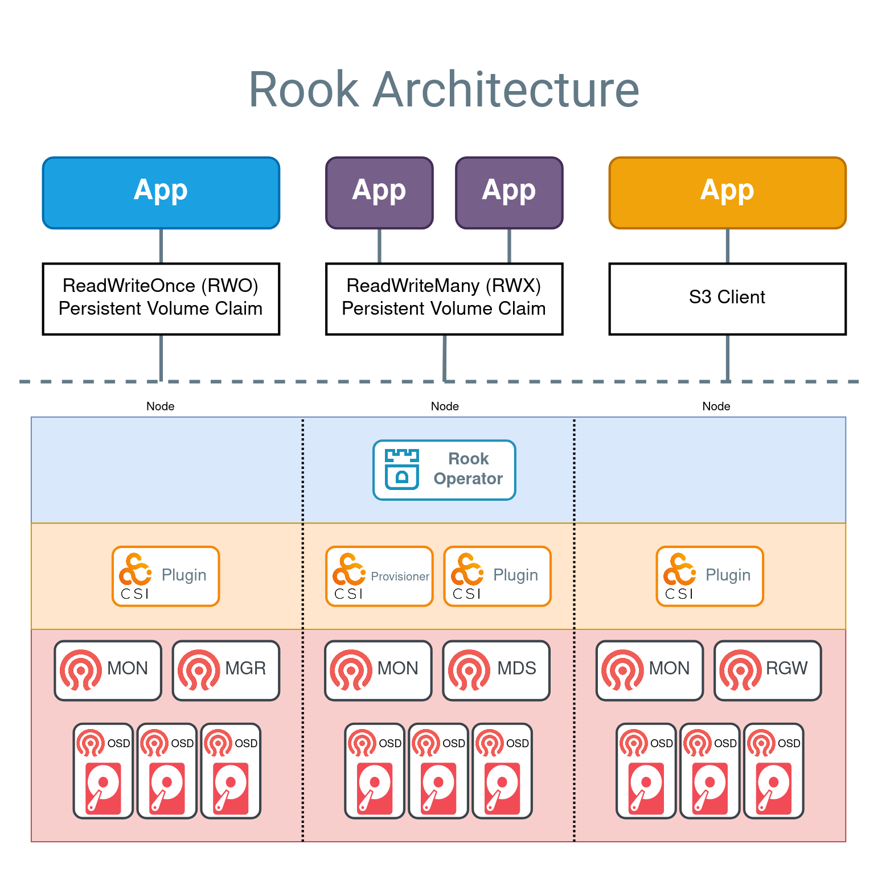

Welcome back to our homelab Kubernetes cluster series. At this stage, we have successfully configured a cluster using refurbished or used hardware and that cluster now has a reverse proxy networking solution, using Cloudflare Tunnels. In this post, we will be installing the popular cloud-native storage solution,  Rook.

To fully appreciate the advantages of clustered storage solutions like Rook, it’s important to understand Kubernetes storage primitives: [Persistent Volumes](https://kubernetes.io/docs/concepts/storage/persistent-volumes/) (PVs), [Persistent Volume Claims](https://kubernetes.io/docs/concepts/storage/persistent-volumes/#persistentvolumeclaims) (PVCs), and [Storage Classes](https://kubernetes.io/docs/concepts/storage/storage-classes/).

Persistent Volumes are storage resources provisioned in a Kubernetes cluster. These volumes exist independently of any specific pod, allowing them to persist beyond the lifecycle of individual pods. PVs can be backed by various storage types, such as local disks, network-attached storage, or cloud storage services.

Persistent Volume Claims are requests for storage by application developers. A PVC specifies the desired storage capacity and access mode (e.g., read-write or read-only). When a PVC is created, Kubernetes matches it with a suitable PV based on the specified requirements. If a matching PV is found, it binds the PVC to the PV, making the storage available to the requesting pod. This abstraction allows users to request storage without needing to know the specifics of the underlying storage infrastructure.

Storage Classes provide a way to describe different types of storage available in a cluster. A Storage Class can define parameters such as the type of storage (e.g., SSD, HDD), replication factors, and other policies related to performance and availability. Administrators can create multiple Storage Classes to offer different levels of service. When application developers create PVCs, they can specify a Storage Class to ensure their storage meets specific performance and durability requirements. Additionally, Storage Classes enable dynamic provisioning, allowing Kubernetes to automatically create and configure PVs as needed, streamlining the storage management process.

If you issue the following command in your cluster, you should see that there are zero entries listed:
`kubectl get storageclass`. Because there are no storage classes installed in your cluster at this time, we are limited to using the `hostPath` volume type.

---

# Just say no...to hostPath storage

Let's do a quick experiment to demonstrate the pitfalls that come with hostPath volumes. We are going to deploy a sample "todo" application, using the Helm chart published at the following address: [todo - Artifact Hub](https://artifacthub.io/packages/helm/nicholaswilde/todo). The application is pretty straightforward: a web interface to input a list of To-Dos.

## Setup

1. Firstly, we will need to install this Helm repository to our machine, with the following command:

    `helm repo add nicholaswilde https://nicholaswilde.github.io/helm-charts/`

2. Next, we want to output the default chart files to our file system, using this command:

    `helm show values nicholaswilde/todo > todo-values.yaml`

3. Open the `todo-values.yaml` file and make the following adjustments:
    - Set `ingress.enabled=true`
    - Set `persistence.data.enabled=true`
    - Set `persistence.data.existingClaim=todo`

4. Before we can install our todo application, we will create the Persistent Volume and Persistent Volume Claim ahead of time. Use `kubectl apply` to create the required objects:

    ```
    apiVersion: v1
    kind: Namespace
    metadata:
      name: todo
    ---
    apiVersion: v1
    kind: PersistentVolume
    metadata:
      name: todo
    spec:
      capacity:
        storage: 1Gi
      accessModes:
        - ReadWriteOnce
      persistentVolumeReclaimPolicy: Retain
      storageClassName: hostpath
      hostPath:
        path: /mnt/data
    ---
    apiVersion: v1
    kind: PersistentVolumeClaim
    metadata:
      name: todo
      namespace: todo
    spec:
      storageClassName: hostpath
      accessModes:
        - ReadWriteOnce
      resources:
        requests:
          storage: 1Gi
    ```

5. Now that we have created the dependencies, let us deploy the application using the following command:

    `helm install -n todo nicholaswilde/todo todo -f todo-values.yaml`

6. Once the command finishes, you should see a message in your terminal that looks something like the example below:

    ```
    ...
    NOTES:
    Get the application URL by running these commands:
      export POD_NAME=$(kubectl get pods --namespace todo -l "app.kubernetes.io/name=todo,app.kubernetes.io/instance=todo" -o jsonpath="{.items[0].metadata.name}")
      echo "Visit http://127.0.0.1:8080 to use your application"
      kubectl port-forward $POD_NAME 8080:8000
    ```

7. Let us now use the port forwarding capabilities of Kubernetes to redirect our ClusterIP service to our local workstation:

    `kubectl -n todo port-forward service/todo 8000:8000`

8. In your web browser, navigate to the following address: `http://localhost:8000`. You should see a user interface similar to the screenshot below. Use the input box to save some todo items:


## Simulate node failure

1. We first must identify which node our application is currently running. You can quickly retrieve that using:

    ```
    kubectl -n todo get pods -o custom-columns="POD:metadata.name,NODE:spec.nodeName"
    ```

2. We will now prevent new pods from being created on this node by issuing:
    
    `kubectl cordon <node>`

3. We now manually delete the pod for the application, triggering it to be scheduled on a new node:

    `k rollout restart -n todo deployment/todo`

3. Because we did not provide any constraints for the Kubernetes scheduler, if you have a healthy cluster with additional nodes ready, a new pod should be created to replace our freshly deleted one. However, since our original node is the only one that hosts the data, let's see what happens for our users...looks like everything is gone:


## Analysis

Okay, so what the heck just happened? This honestly threw me for a loop when I was doing my initial testing. I did not expect this outcome. What I expected to happen here was that once the original pod had been killed, the Kubernetes scheduler would fail to schedule a new pod because that pod was using a Persistent Volume set to hostPath. What actually happens is more insidious: Kubernetes happily schedules the new pod, without a care in the world for where the pod should reside. The data present in these hostPath directories is "out of band" as far as Kubernetes is concerned.

There are plenty of legitimate use cases for hostPath storage. Here are a few pulled from the [Kubernetes documentation](https://kubernetes.io/docs/concepts/storage/volumes/#hostpath):
- running a container that needs access to node-level system components (such as a container that transfers system logs to a central location,accessing those logs using a read-only mount of /var/log)
- making a configuration file stored on the host system available read-only to a static pod; unlike normal Pods, static Pods cannot access ConfigMaps

But for mission critical applications, we need a way to decouple pods from nodes to ensure high availability.

## Cleanup

Make sure you clean up after this experiment, we will delete everything except the namespace:
- `helm -n todo uninstall todo`
- `kubectl -n todo delete pvc/todo`
- `kubectl -n todo delete pv/todo`

---

# What is Rook?

[Rook](https://rook.io/) is an open-source cloud-native storage orchestrator for Kubernetes, designed to manage and automate the deployment, configuration, scaling, and maintenance of storage systems. By abstracting the complexity of storage management, Rook enables users to leverage powerful distributed storage systems like Ceph, Cassandra, NFS, and more, as self-managing, self-scaling, and self-healing storage services. Rook integrates seamlessly with Kubernetes, allowing storage resources to be provisioned dynamically and managed alongside application workloads, simplifying the overall infrastructure and operational workflow.



Rook provides several key benefits for Kubernetes environments. It enables seamless integration of storage into Kubernetes clusters, providing persistent storage that can be used by stateful applications. With Rook, administrators can automate complex storage operations such as deployment, resource allocation, scaling, and recovery, thereby reducing manual intervention and operational overhead. Additionally, Rook's self-healing capabilities ensure that the storage infrastructure remains robust and resilient, automatically handling failures and maintaining data availability. 

# What is Ceph?

[Ceph](https://ceph.io/) is a highly scalable, software-defined storage system that unifies object, block, and file storage, making it ideal for enterprises, academic institutions, and beyond. Leveraging the advanced [CRUSH algorithm](https://docs.ceph.com/en/latest/rados/operations/crush-map/), Ceph ensures rapid scaling without downtime and mitigates single points of failure and performance bottlenecks. Its self-managing and self-healing capabilities offer unparalleled reliability and data integrity, automatically rectifying issues before they become apparent. Ceph's flexibility allows it to be tailored to existing setups or deployed on commodity hardware, providing a cost-effective alternative to traditional, proprietary storage solutions. This makes Ceph an excellent choice for handling rapid and unpredictable data growth, enhancing performance, and supporting diverse storage needs, all while simplifying infrastructure and driving innovations in AI and ML.

---

# Install and Configure Rook/Ceph

## Prerequisites

I want to quickly address a few points before we begin the setup procedure. There are some requirements associated with Rook and I want to ensure that you don't proceed any further if your cluster does not meet those. Rook supports Kubernetes versions v1.25 through v1.30, so if you installed your cluster recently, you should be good here. The Rook operator also mandates the presence of specific Linux Kernel modules, however most modern Linux distributions should have these already.

To configure the Ceph cluster, at least one of these local storage types is required:
- Raw devices (no partitions or formatted filesystems)
- Raw partitions (no formatted filesystem)
- LVM Logical Volumes (no formatted filesystem)
- Persistent Volumes available from a storage class in block mode

Ceph clusters do not necessitate drives of the same size; however, uniform drive sizes simplify capacity planning and performance tuning. Mixed drive sizes can be managed by the CRUSH algorithm, which optimizes data placement, but may require careful configuration to avoid imbalances and ensure optimal performance and storage efficiency. So if you want to be safe, do what I did and purchase several identical drives.

The full set of requirements can be found at the following address: [Rook Prerequisites](https://rook.github.io/docs/rook/latest-release/Getting-Started/Prerequisites/prerequisites/).

## Install Rook

Now that we know what Rook and Ceph are and why they are valuable to our goal of reliable and performant storage on our cluster, let's get into installing and configuring it on our cluster. Because storage systems like Rook are so complex, the installation process will have minor variations depending on your specific Kubernetes distribution.

1. Add the Rook Helm repository

    `helm repo add rook-release https://charts.rook.io/release`

2. Extract default chart values to local file

    `helm show values rook-release/rook-ceph > rook-values.yaml`

    In terms of what values we need to pass to the Helm chart for installation, that is going to depend on which distribution you are using. In my case, there was just one parameter I needed to add to the default chart values.yaml file to properly create a cluster (after pulling my hair out for hours):

    ```
    csi:
      ...
      kubeletDirPath: /var/snap/microk8s/common/var/lib/kubelet/
    ```

3. Install the operator
    
    `helm install --create-namespace --namespace rook-ceph rook-ceph rook-release/rook-ceph -f rook-values.yaml`


As with our previous Helm installation, you should see a short message displayed in your console once the installation is successfully completed. Now let's use the operator to actually provision storage.

## Create Ceph cluster

The first step here is to provision the Ceph cluster. The Rook GitHub repository has a plethora of examples, depending on your needs. If you want to experiment with other configurations or view where I sourced these from: [Rook Examples](https://github.com/rook/rook/tree/release-1.14/deploy/examples). Below is the manifest I am currently using in my installation:

    ```
    apiVersion: ceph.rook.io/v1
    kind: CephCluster
    metadata:
      name: rook-ceph
      namespace: rook-ceph
    spec:
      cephVersion:
        image: quay.io/ceph/ceph:v18.2.2
      dataDirHostPath: /var/lib/rook
      mon:
        count: 3
        allowMultiplePerNode: false
      dashboard:
        enabled: true
      storage:
        useAllNodes: true
        useAllDevices: true
        deviceFilter: nvme0n1
    ```

Let me quickly run through this resource and what some of these parameters mean.

The `dataDirHostPath` parameter is setting the mount point for our newly provisioned volumes. This can be any path, so long as there are no conflicts with existing mount points. Try to use common Linux data directories (/var/lib, /data, /etc), if possible.

The `mon` block in the specification refers to [Ceph monitors](https://rook.io/docs/rook/v1.14/Storage-Configuration/Advanced/ceph-mon-health/), which are described as the "brains" of the cluster. They are responsible for managing metadata necessary to store and retrieve your data. Ensuring monitors are healthy is vital to a healthy cluster. As with other distributed systems, specify an odd number of monitors to ensure the highest availability. This is related to the concept of [quorum](https://en.wikipedia.org/wiki/Quorum_(distributed_computing)), which is very important to understand when working with distributed systems. In most cases, this should be set to one per node.

The `storage` block is also very important here. Rook provides different ways to specify which nodes and block devices should be registered to the cluster. The simplest method is to set `storage.useAllNodes` and `storage.useAllDevices` to `true` and then use the `storage.deviceFilter` parameter to target specific block devices. Since I am using all NVMe drives for my Ceph cluster, I use the device name which corresponds to the first NVMe drive installed. If you were using SATA drives for your cluster, you would use `storage.deviceFilter=sda`.

Ensure that you have adjusted these parameters to match your hardware configuration and create the cluster: `kubectl apply -f ceph-cluster.yaml`. 

There are a number of things that can go wrong here, so you need to monitor the installation carefully. Firstly, check the status of the `CephCluster` resource by issuing the command `kubectl get cephcluster`. Once the `phase` is marked as `Ready`, that means that the cluster was successfully provisioned. The installation can take quite a while to complete, so I would recommend monitoring the pods created in the namespace. If there are any provisioning issues, you will likely see that by viewing pod logs.

## Create Ceph Block Pool

A Ceph block pool is a logical grouping of storage within a Ceph cluster, used to manage block storage efficiently. It allows for customized data replication, erasure coding, and CRUSH rules for optimized data distribution and fault tolerance. Block pools can be configured with performance settings and quotas to control resource usage.

Our configuration will be pretty basic:

```
apiVersion: ceph.rook.io/v1
kind: CephBlockPool
metadata:
  name: replicapool
  namespace: rook-ceph
spec:
  failureDomain: host
  replicated:
    size: 3
    requireSafeReplicaSize: true
```

As in previous steps, once this object has been created, check the status to ensure that the provisioning is successful by using `kubectl get cephblockpool` and examining the `phase` attribute.


## Create Storage Class

We are now ready to create our Storage Class and actually start using the cluster. Although not required, I would recommend setting the annotation to make this Storage Class the default.

```
apiVersion: storage.k8s.io/v1
kind: StorageClass
metadata:
  name: rook-ceph-block
  annotations:
    storageclass.kubernetes.io/is-default-class: "true"
provisioner: rook-ceph.rbd.csi.ceph.com # csi-provisioner-name
parameters:
  clusterID: rook-ceph
  pool: replicapool
  imageFormat: "2"
  imageFeatures: layering
  csi.storage.k8s.io/provisioner-secret-name: rook-csi-rbd-provisioner
  csi.storage.k8s.io/provisioner-secret-namespace: rook-ceph 
  csi.storage.k8s.io/controller-expand-secret-name: rook-csi-rbd-provisioner
  csi.storage.k8s.io/controller-expand-secret-namespace: rook-ceph 
  csi.storage.k8s.io/node-stage-secret-name: rook-csi-rbd-node
  csi.storage.k8s.io/node-stage-secret-namespace: rook-ceph 
  csi.storage.k8s.io/fstype: ext4
allowVolumeExpansion: true
reclaimPolicy: Delete
```

## Todo App v2

We are now going to use our shiny new Ceph cluster for provisioning Persistent Volumes for the todo application we tested with earlier. If you set the newly created Storage Class as default, the only change needed to the chart values is to remove the `persistence.data.existingClaim` parameter. We are simply going to re-run the install command and go through the node failure simulation we completed earlier. Let's see what happens when the workload is shifted onto a new node:


Zero data loss! Woo. Now that Ceph is handling our data replication needs, we no longer need to worry about nodes going offline and losing access to our data. If you are finished experimenting with the todo application, make sure to uninstall the Helm release in the same manner as before. This will also delete the associated PV and PVC, as they were created by the chart.

---

# Next Steps

We have successfully dealt with two of the biggest factors when it comes to cluster administration: networking and storage. 

In the enterprise world, the integrity and availability of data is arguably the most important factor when it comes to your I.T. infrastructure. Many large companies and government institutions are using Ceph clusters at massive scale. In fact, [Ceph is currently being used by CERN for a 65 petabyte storage cluster](https://ceph.com/community/new-luminous-scalability/). If one of the largest research institutions in the world trusts this storage solution, I'm pretty sure it can candle my puny 3 terabyte cluster with ease.

We have not discussed monitoring and alerting yet, because I am saving those topics for a later installation in this series. But if you want to get into the weeds, head over to the [Rook documentation](https://rook.io/docs/rook/latest-release/Getting-Started/intro/). You can easily get lost down there for hours, if you're an uber nerd like me.